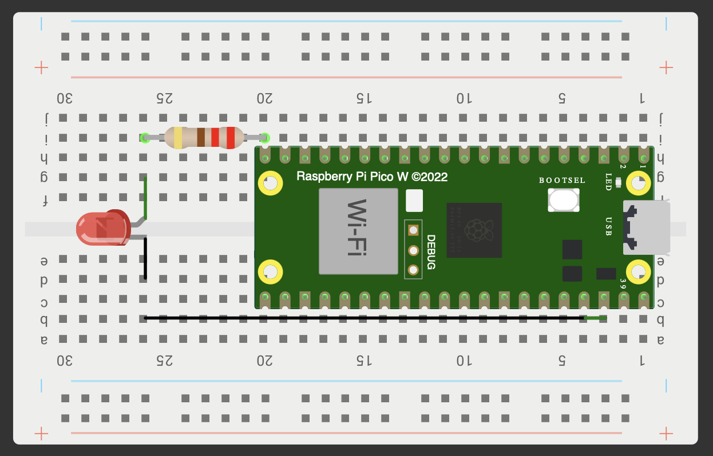

# Raspberry Pi Pico W Projects

This repository contains my code solutions and circuit diagrams 
for the [`Raspberry Pi Pico W Lessons for Absolute Beginners`](https://www.youtube.com/playlist?list=PLGs0VKk2DiYz8js1SJog21cDhkBqyAhC5)

assignment.py: These files contain the code as provided by the teacher in the video tutorial.
hw.py: These files are my homework solutions. They contain the code I developed to complete the lesson's assignments or challenges.
I'll only be providing detailed descriptions and explanations in this README for the hw files, as these are my direct contributions and solutions to the course material.

## lesson 1 Write Your First Program for Absolute Beginners
[`hw1.py`](https://github.com/fullstackdevell/pico-w/blob/main/lesson%201/hw1.py)
This challenge explores how fast the Pico W's onboard LED can blink using myLed.toggle() and a very short delay. No external wiring or pinout diagram is needed for this lesson, as we're only using the built-in LED.

## lesson 2 Understanding and Using Breadboards
[`hw1.py`](https://github.com/fullstackdevell/pico-w/blob/main/lesson%202/hw1.py)
This challenge creates a SOS signal using an external LED connected to GPIO15. The code blinks the LED in a pattern of three short, three long, and three short flashes.

## lesson 4 Create a Binary Counter Using the Pico W

## lesson 5 Reading Analog Voltages Using a Potentiometer

## lesson 6 Understanding if Statements in MicroPython

## lesson 12 Understanding and Controlling an RGB LED in MicroPython

## lesson 17 Buttons and Pull Up Resistors in MicroPython

## lesson 19 Button Control of RGB LED in MicroPython

## lesson 20 Using the DHT11 Temperature and Humidity Sensor
